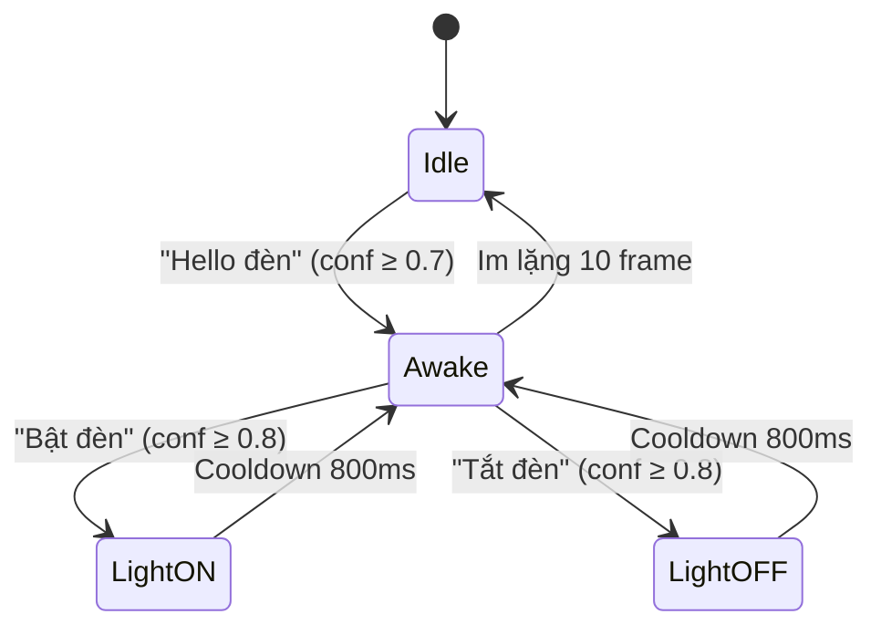

# 💡 AIOT Smart Light – Điều Khiển Đèn Thông Minh Bằng Giọng Nói

[](https://github.com/tangmanh891/AIOT-Smart-Light-Voice/actions/workflows/ci.yml)
[](https://www.espressif.com/en/products/socs/esp32)
[](https://www.arduino.cc/)
[](LICENSE)

Hệ thống điều khiển đèn thông minh sử dụng **ESP32** và micro **INMP441**, nhận diện giọng nói tiếng Việt bằng mô hình AI chạy trực tiếp trên vi điều khiển (Edge AI) thông qua **Edge Impulse**, kết hợp điều khiển từ xa qua **SinricPro** (Alexa / Google Home).

## 🎬 Demo

<div align="center">
  <video src="demo.mp4" width="100%" controls></video>
</div>

## ✨ Tính Năng

| Tính năng | Mô tả |
|---|---|
| 🎙️ **Điều khiển giọng nói** | Nhận diện lệnh tiếng Việt: *"Hello đèn"* (đánh thức) → *"Bật đèn"* / *"Tắt đèn"* |
| 🌐 **IoT (SinricPro)** | Điều khiển từ xa qua ứng dụng SinricPro, Amazon Alexa, Google Home |
| 🔘 **Nút bấm vật lý** | Bật/tắt đèn bằng nút nhấn với chống dội (debounce) |
| 🧠 **Edge AI** | Mô hình ML chạy trực tiếp trên ESP32, không cần kết nối cloud để nhận diện giọng nói |
| ⚡ **Wake Word** | Chế độ lắng nghe thông minh — chỉ xử lý lệnh sau khi nghe từ đánh thức |
| 🔄 **Đồng bộ trạng thái** | Trạng thái đèn được đồng bộ giữa tất cả nguồn điều khiển (giọng nói, nút bấm, IoT) |

## 🏗️ Kiến Trúc Hệ Thống

```
┌─────────────────────────────────────────────────────┐
│                      ESP32                          │
│                                                     │
│  ┌──────────┐   ┌────────────────┐   ┌───────────┐ │
│  │  INMP441 │──▶│ Audio Capture  │──▶│ Edge      │ │
│  │  (Mic)   │   │ (I2S + DMA)    │   │ Impulse   │ │
│  └──────────┘   └────────────────┘   │ Inference  │ │
│                                      └─────┬──────┘ │
│                                            │        │
│  ┌──────────┐                        ┌─────▼──────┐ │
│  │  Button  │───────────────────────▶│   Light    │ │
│  │  (GPIO)  │                        │ Controller │ │
│  └──────────┘                        └─────┬──────┘ │
│                                            │        │
│  ┌──────────────────┐                ┌─────▼──────┐ │
│  │   SinricPro      │◀──────────────▶│    LED     │ │
│  │ (WiFi + Cloud)   │                │  (GPIO 5)  │ │
│  └──────────────────┘                └────────────┘ │
└─────────────────────────────────────────────────────┘
```

## 📋 Yêu Cầu Phần Cứng

| Linh kiện | Số lượng | Ghi chú |
|---|:---:|---|
| ESP32 DevKit V1 | 1 | Vi điều khiển chính |
| INMP441 (Micro I2S) | 1 | Thu âm giọng nói |
| LED | 1 | Đèn được điều khiển |
| Nút nhấn | 1 | Điều khiển thủ công |
| Điện trở 220Ω | 1 | Cho LED |
| Breadboard + dây nối | — | Kết nối mạch |

## 🔌 Sơ Đồ Kết Nối

| INMP441 | ESP32 |
|:---:|:---:|
| SCK | GPIO 26 |
| WS | GPIO 25 |
| SD | GPIO 22 |
| VDD | 3.3V |
| GND | GND |
| L/R | GND |

| Thiết bị | ESP32 |
|:---:|:---:|
| LED (+) | GPIO 5 |
| Button | GPIO 18 (INPUT_PULLUP) |

## 🚀 Hướng Dẫn Cài Đặt

### 1. Clone dự án

```bash
git clone https://github.com/tangmanh891/AIOT-Smart-Light-Voice.git
cd AIOT-Smart-Light-Voice
```

### 2. Cấu hình thông tin đăng nhập

Sao chép file mẫu và điền thông tin thực:

```bash
cp secrets.example.h secrets.h
```

Chỉnh sửa `secrets.h`:

```cpp
#define WIFI_SSID     "Tên_WiFi_của_bạn"
#define WIFI_PASS     "Mật_khẩu_WiFi"

#define APP_KEY       "SinricPro_App_Key"
#define APP_SECRET    "SinricPro_App_Secret"
#define DEVICE_ID     "SinricPro_Device_ID"
```

### 3. Cài đặt SinricPro

1. Đăng ký tài khoản tại [sinric.pro](https://sinric.pro)
2. Tạo thiết bị mới (loại **Switch**)
3. Sao chép **App Key**, **App Secret** và **Device ID** vào `secrets.h`

### 4. Build & Upload

#### Sử dụng PlatformIO (khuyến nghị)

```bash
# Cài PlatformIO CLI hoặc dùng extension trên VS Code
pio run --target upload
pio device monitor
```

#### Sử dụng Arduino IDE

1. Cài đặt **ESP32 Board** trong Board Manager
2. Cài các thư viện: `ArduinoJson@7.4.2`, `SinricPro@3.5.2`, `WebSockets@2.7.1`
3. Sao chép thư mục `lib/ESP32_INMP441_inferencing` vào thư mục libraries của Arduino
4. Mở `esp32_microphone.ino` và upload

## 🗂️ Cấu Trúc Dự Án

```
AIOT-Smart-Light-Voice/
├── esp32_microphone.ino        # Entry point — setup() & loop()
├── platformio.ini              # Cấu hình PlatformIO
├── secrets.example.h           # Mẫu thông tin đăng nhập
├── demo.mp4                    # Video demo
├── src/
│   ├── config.h                # Cấu hình pin, ngưỡng, thời gian
│   ├── credentials.h           # Tự động tìm secrets.h
│   ├── audio_capture.h/.cpp    # Thu âm I2S từ INMP441
│   ├── inference_controller.h/.cpp  # Nhận diện giọng nói (Edge Impulse)
│   ├── light_controller.h/.cpp # Điều khiển LED
│   ├── button_controller.h/.cpp # Xử lý nút bấm (debounce)
│   └── iot_controller.h/.cpp   # Kết nối SinricPro (WiFi + Cloud)
├── lib/
│   └── ESP32_INMP441_inferencing/  # Thư viện mô hình Edge Impulse
└── .github/
    └── workflows/ci.yml        # CI pipeline (lint + build)
```

## 🎤 Luồng Nhận Diện Giọng Nói



1. **Trạng thái Idle** — Hệ thống liên tục lắng nghe từ đánh thức *"Hello đèn"*
2. **Trạng thái Awake** — LED nháy xác nhận, chờ lệnh *"Bật đèn"* hoặc *"Tắt đèn"*
3. **Thực thi lệnh** — Bật/tắt đèn, sau đó quay lại chờ lệnh tiếp
4. **Tự động thoát** — Nếu im lặng quá lâu (10 frame liên tiếp), quay về Idle

## ⚙️ Cấu Hình

Các thông số có thể tùy chỉnh trong [`src/config.h`](src/config.h):

| Thông số | Giá trị mặc định | Mô tả |
|---|:---:|---|
| `kMinWakeConf` | 0.7 | Ngưỡng tin cậy cho từ đánh thức |
| `kMinCmdConf` | 0.8 | Ngưỡng tin cậy cho lệnh bật/tắt |
| `kImLangMaxFrames` | 10 | Số frame im lặng để quay về Idle |
| `kActionCooldownMs` | 800ms | Thời gian chờ giữa các lệnh |
| `kDebounceDelayMs` | 50ms | Thời gian chống dội nút bấm |

## 🛠️ Công Nghệ Sử Dụng

- **Vi điều khiển:** ESP32 (Espressif)
- **Micro:** INMP441 (giao tiếp I2S)
- **AI/ML:** [Edge Impulse](https://edgeimpulse.com/) — nhận diện giọng nói on-device
- **IoT Platform:** [SinricPro](https://sinric.pro/) — tích hợp Alexa / Google Home
- **Build System:** [PlatformIO](https://platformio.org/) / Arduino IDE
- **CI/CD:** GitHub Actions (Arduino Lint + Compile)

## 🤝 Đóng Góp

Mọi đóng góp đều được hoan nghênh! Hãy tạo [Issue](https://github.com/tangmanh891/AIOT-Smart-Light-Voice/issues) hoặc [Pull Request](https://github.com/tangmanh891/AIOT-Smart-Light-Voice/pulls).

## 📝 Giấy Phép

Dự án được phát hành theo giấy phép [MIT](LICENSE).
